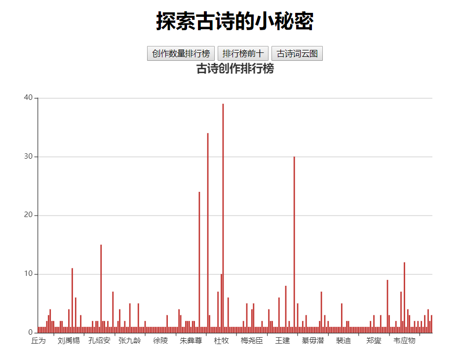
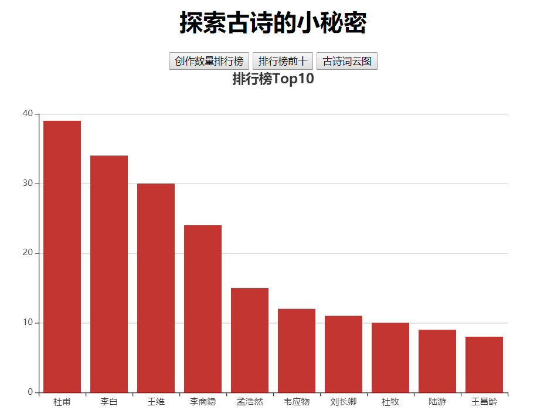
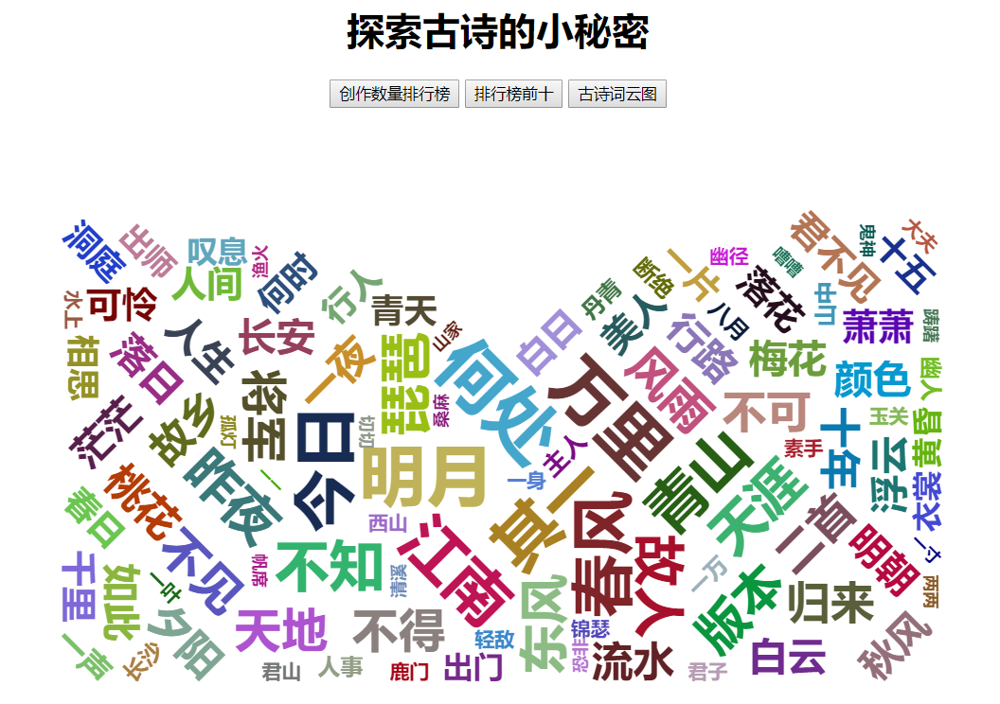
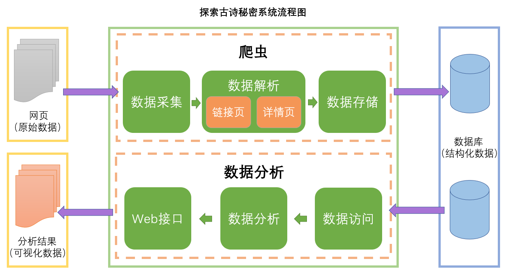

## 项目名称

探索古诗的小秘密

## 项目描述

让我们一起通过这个小项目来了解古诗吧！

## 项目效果
+ 创作数量排行榜

+ 排行榜前十

+ 古诗词云图

## 涉及技术

+ Stream和Lambda
+ 文本分词和解析 ansj 
+ 多线程
+ 网页解析工具 htmlunit 
+ 数据库和JDBC编程
+ 数据可视化
+ Sparkjava嵌入式Web容器构建web应用
+ DIY构建对象管理工厂

## 实现功能

+ 数据的采集、解析与存储
+ 数据的访问、分析与可视化展示
    + 统计诗人与其创作诗歌数量之间的关系
    + 统计古诗中的高频词

## 具体实现

+ 爬虫
    + 采集
        + 模拟浏览器发出请求，获取网页数据。
    + html文档解析
        + 将采集到的网页，通过对标签进行解析，获取到文档片段。
            + 详情页：对详情页中的文档片段进行更加细致的信息抽取。
            + 链接页：没有古诗的正文，但有每首诗正文的超链接。通过超链接获取到详情页。
    + 数据存储及访问
        + 利用JDBC，在数据库中进行数据的存取。
+ 数据分析
    + 数据分析
        + 利用sql语句来统计诗人的创作数量
        + 利用ansj实现文本的分词
    + Web接口
        + 利用 Sparkjava嵌入式Web容器，将可视化结果显示在页面中。

## 扩展
+ 利用JavaEE进行优化